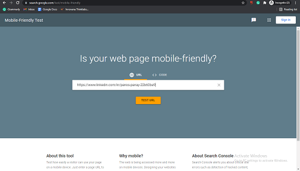
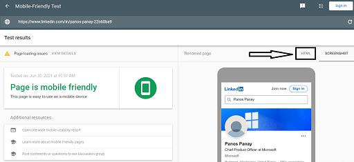
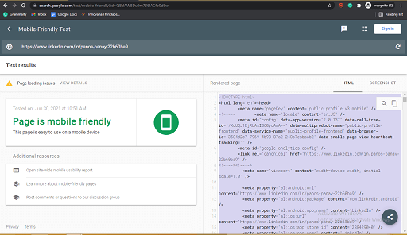
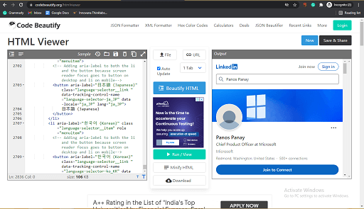

### How to see linkedin profile anonymously

If you are wondering how to see LinkedIn profile without login, then this method can help you. Google provides a service called Mobile-Friendly test to analyze whether a website is mobile-friendly or not. 

You can use this test to see LinkedIn profile without logging in. here’s how to do that:

1. Visit [Google’s Mobile-Friendly test](https://search.google.com/test/mobile-friendly)
2. Paste the profile URL on this tester and **Test the URL**
3. After the website completes Analyzing the website, click on the **Source Code** or **HTML.** 
4. Copy the code
   
5. **Paste the code** on any HTML support website or viewer like [CodeBeautify](https://codebeautify.org/htmlviewer).

The HTML viewer will show the webpage, just like the original. And, with the help of this method, you can view a LinkedIn profile without logging in.

